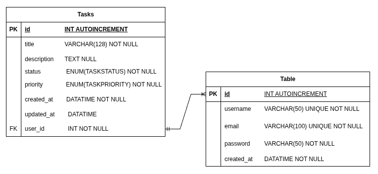
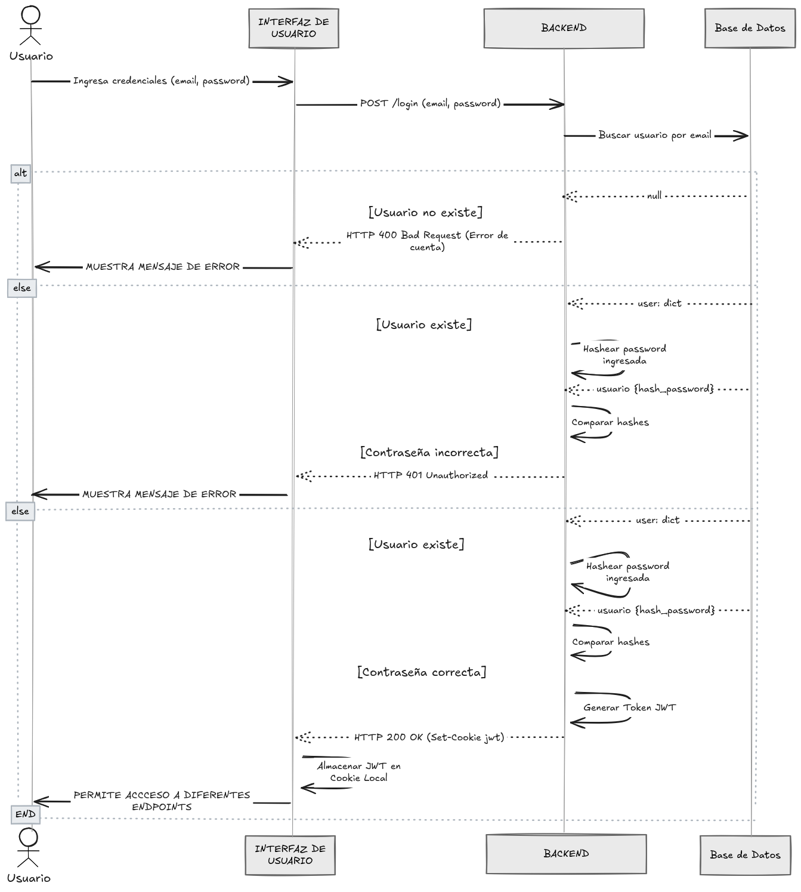
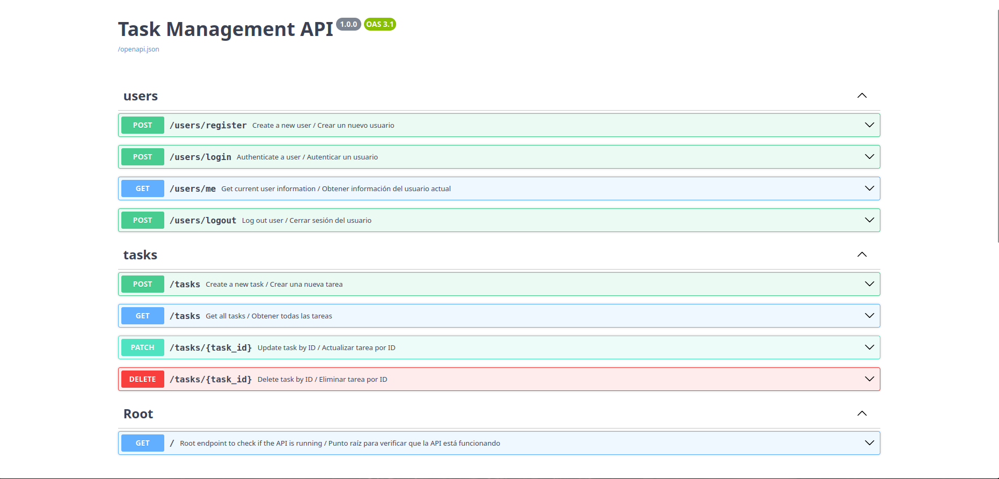
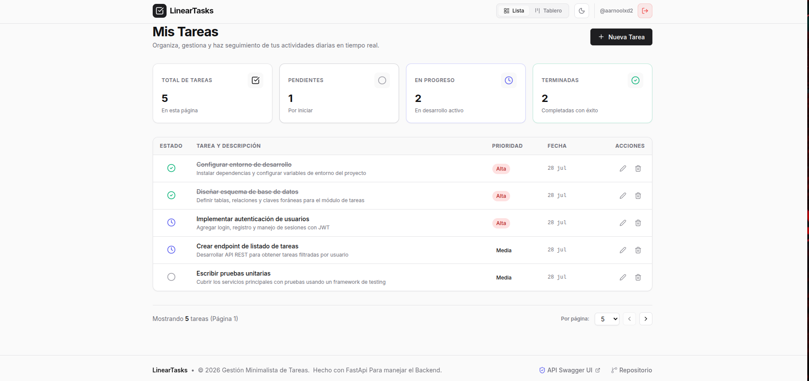

[English](README.md) | [Spanish](README-es.md)    

# Simple Tasks API (Task Management API)


A robust, RESTful API built with **FastAPI** and **SQLAlchemy** for efficient user and task management. It features secure JWT-based authentication, user data isolation, and comprehensive API documentation out-of-the-box.

---

## Table of Contents
- [Features](#features)
- [Technologies Used](#technologies-used)
- [Installation and Configuration](#installation-and-configuration)
- [Environment Variables](#environment-variables)
- [API Endpoints](#api-endpoints)
- [Diagrams and Architecture](#diagrams-and-architecture)
- [Screenshots & Examples](#screenshots--examples)
- [Project Structure](#project-structure)

---

## Features

- **User Authentication**: Secure registration and login using OAuth2 with hashed passwords.
- **JWT Authorization**: Session management using secure, HTTP-only cookies.
- **Data Isolation**: Users can only access and modify their own tasks.
- **Pagination**: Efficient data retrieval for tasks with built-in pagination support.
- **Validation**: Strict request/response data validation using Pydantic.
- **Database Migrations**: Seamless schema management using Alembic.

---

## Technologies Used

- **Framework**: [FastAPI](https://fastapi.tiangolo.com/) - Fast web framework for building APIs with Python.
- **ORM**: [SQLAlchemy](https://www.sqlalchemy.org/) - Object Relational Mapper for robust database interactions.
- **Database**: [PyMySQL](https://pymysql.readthedocs.io/) - Python connector for synchronous MySQL databases.
- **Validation**: [Pydantic](https://docs.pydantic.dev/) - Data validation and settings management.
- **Migrations**: [Alembic](https://alembic.sqlalchemy.org/) - Lightweight database migration tool.

---

## Installation and Configuration

### 1. Prerequisites
Make sure you have **Python 3.14 or higher** installed.

### 2. Environment Setup
It is highly recommended to use a virtual environment. This project uses `uv` for fast dependency management, but standard `pip` works perfectly too.

```bash
# Using uv (Recommended)
uv venv
source .venv/bin/activate
uv pip install -r requirements.txt

# Using standard pip
python -m venv .venv
source .venv/bin/activate
pip install -r requirements.txt
```

### 3. Database Migrations
Before running the application, ensure your database is running and apply the migrations using Alembic to create the necessary tables:

```bash
alembic upgrade head
```

### 4. Run the Application
You can start the development server locally with the following command (using `fastapi-cli`):

```bash
fastapi dev src/main.py
```

The API will be available at `http://localhost:8000`.
You can explore the interactive API documentation (Swagger UI) at `http://localhost:8000/docs`.

> **Live Demo:** You can access the deployed interactive documentation without cloning the project at [https://tareas-api-lc94.onrender.com/docs](https://tareas-api-lc94.onrender.com/docs).
> *Note: If the documentation takes a few seconds to load initially, it is because the backend is deployed on a free Render instance that sleeps after a period of inactivity. We appreciate your patience while it wakes up!*

---

## Environment Variables

To run this project locally with a real database, you must create a `.env` file in the root directory based on the provided `.env.example`:

```env
DB_USER=your_db_user
DB_PASSWORD=your_db_password
DB_HOST=localhost
DB_PORT=3306
DB_NAME=your_db_name
SECRET_KEY=your_super_secret_key
FRONTEND_URL=http://localhost:3000
```

---

## API Endpoints

### Health & Root
| Method | Endpoint | Description |
|--------|----------|-------------|
| `GET` | `/` | Health check endpoint to verify that the API is running. **(Rate Limit: 5/minute)** |

### Users (Authentication & Management)
| Method | Endpoint | Description |
|--------|----------|-------------|
| `POST` | `/users/register` | Registers a new user account. Validates unique username and email, and hashes the password. **(Rate Limit: 10/hour)** |
| `POST` | `/users/login` | Authenticates a user with OAuth2 credentials and sets a secure HTTP-only JWT cookie (`auth_token`). **(Rate Limit: 5/minute)** |
| `GET` | `/users/me` | Retrieves the profile information of the currently authenticated user. **(Rate Limit: 10/minute)** |
| `POST` | `/users/logout` | Logs out the user by clearing the authentication cookie. **(No specific limit)** |

### Tasks (User Isolated)
| Method | Endpoint | Description |
|--------|----------|-------------|
| `POST` | `/tasks` | Creates a new task associated with the authenticated user. **(Rate Limit: 10/minute)** |
| `GET` | `/tasks` | Retrieves a paginated list of all tasks belonging to the authenticated user. **(Rate Limit: 10/minute)** |
| `PATCH`| `/tasks/{task_id}`| Partially or totally updates a task's details by ID. Restricted to the task owner. **(Rate Limit: 10/minute)** |
| `DELETE`| `/tasks/{task_id}`| Deletes a task by ID. Restricted to the task owner. **(Rate Limit: 10/minute)** |

---

## Diagrams and Architecture

### Physical Model


### Sequence Diagram: JWT Token Creation


### Flowchart: Account Creation
.png)

### Protected Endpoints (Requires JWT)
.png)

---

## Screenshots & Examples

### API Documentation (Swagger UI)


### Frontend Use Case Example
You can test the live frontend application here: **[Frontend Demonstration](https://frontend-seven-livid-1rwmj8gd6q.vercel.app/)**



> **Important Note:** If the frontend takes a few seconds to respond on the initial load, it is because the backend is deployed on a free instance on Render. We appreciate your patience while it spins back up!

---

## Project Structure

```text
├── alembic/              # Database migrations configuration and versions
├── docs/                 # Documentation files and assets
│   ├── README.md
│   └── README-es.md
├── src/                  # Main source code
│   ├── core/             # Cross-cutting functionalities (security, custom exceptions)
│   ├── domains/          # Business logic separated by domains (users, tasks)
│   ├── config.py         # App configuration & environment variables settings
│   ├── database.py       # Database connection & SQLAlchemy session management
│   ├── dependencies.py   # Global FastAPI dependencies (e.g., get_db, get_current_user)
│   ├── main.py           # FastAPI entry point, CORS, router registration
│   └── models.py         # Aggregator for ORM models (used by Alembic)
├── tests/                # Automated unit and integration tests (Pytest)
├── .env                  # Environment variables (not in VCS)
├── .env.example          # Template for environment variables
├── alembic.ini           # Alembic configuration file
├── pyproject.toml        # Project metadata and dependencies
└── requirements.txt      # Standard requirements file
```
